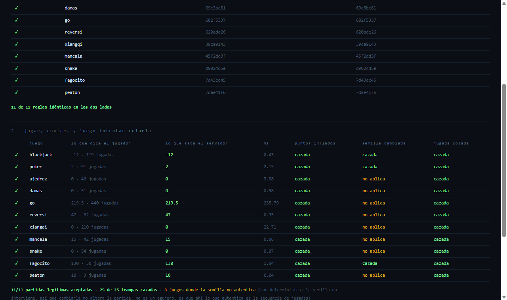
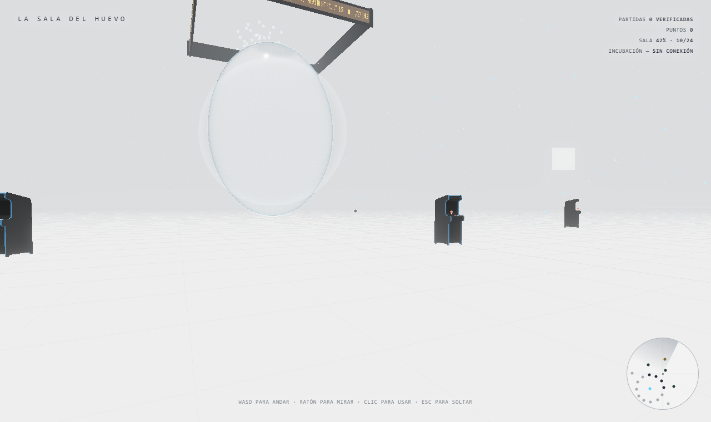
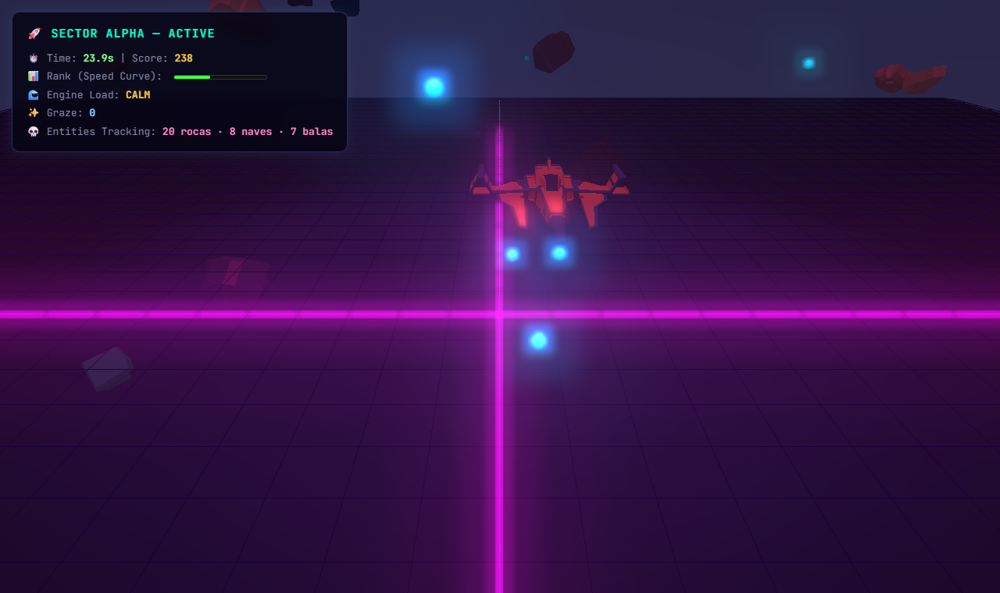
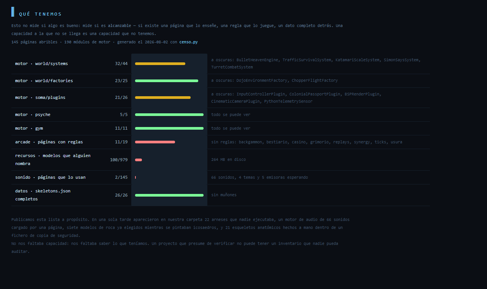

# alisa-engine · La Sala del Huevo

[](https://github.com/AlisaSoulJar/alisa.systems/actions/workflows/ci.yml)
[](LICENSE)
[](#funciona-sin-conexión-y-eso-está-medido)

**Juegas en una sala 3D, y tu partida son unos cientos de bytes que cualquiera
puede volver a jugar para comprobar que es verdad.**

Un motor 3D ligero con una puerta al gym: el mismo entorno se juega con una
política numérica, con un LLM que razona en verbos, o con las manos — y las tres
producen la misma puntuación, verificable.

Sin instalar nada. Sin backend. Abres un `.html` y funciona.

<!-- Las capturas van arriba a propósito. Este README tenía CERO imágenes, y el
     repositorio entero tampoco tenía una sola: un motor 3D sin una imagen se
     lee como humo, por muy bien que esté escrito lo de abajo. -->



*La puntuación no se envía: se recalcula. El servidor vuelve a jugar tu partida
con el mismo fichero de reglas — arriba, las once huellas idénticas que prueban
que los dos lados juegan al mismo juego; abajo, once partidas legítimas
aceptadas y veinticinco trampas cazadas, sin que ningún juez opine.*

| | |
|:--:|:--:|
|  |  |
| **La Sala del Huevo** — 27 máquinas, y sólo existen cuando te acercas | **`OrbitalKinematicsSystem`** — ocho comportamientos de enemigo, sin pantalla en su arnés y con ella aquí |

```
motor completo + three.js  ≈ 2,2 MB
un zapato entero de blackjack (54 manos)  =  1 KB  ·  se verifica en 0,5 ms
```

---

## El escaparate: `rooms/room_sala_del_huevo.html`

Una sala por la que **se anda**, con 27 máquinas: arcades, mesas de tablero y
cartas, terminales, y un huevo en el centro que dobla el espacio a su alrededor.
Te sientas en una máquina, el juego aparece en su pantalla, juegas. Al
levantarte, la sala te da **tu partida**:

```
TU ÚLTIMA PARTIDA                    VERIFICADA
juego     blackjack
semilla   4085196618
jugadas   24
tamaño    625 B
                        [ COPIAR PARTIDA ]
                        [ INTENTA FALSEARLA ]
```

Ese segundo botón es el producto entero en un clic: falsea tu propia partida
delante de ti y enseña por qué cae cada trampa.

```
✕ inflar la puntuación  — la puntuación no cuadra: dice 9999, sale 0
✕ cambiar la semilla    — jugada 2 ilegal: 'deal'
✕ colar una jugada      — jugada 25 ilegal: 'volar'
✕ reordenar las jugadas — jugada 5 ilegal: 'hit'
```

*Decir «esto no se puede falsear» es marketing. Dejar que lo intentes y ver al
verificador cazarlo es una prueba.* Y es honesto en las dos direcciones: si un
día una trampa colara, ese botón lo enseñaría.

**En la sala solo puntúa lo que juegas.** Pasear no da puntos — lo comprobamos
midiendo: recorrer ocho estaciones, 0 puntos; catorce jugadas de blackjack, 14.

---

## Por qué existe

Los gyms que hay (Gym/Gymnasium, MineRL, ALE) son de **RL numérico**: observación
en vector, acción en vector. Un LLM ahí está fuera de sitio — no tiene reflejos y
no debería necesitarlos para demostrar que razona.

Aquí cada entorno tiene **tres puertas** y **una sola métrica**:

| puerta | interfaz | para quién |
|---|---|---|
| 🤖 numérica | `reset(seed)` · `step(action)` · `getObservation()` | políticas, RL, DQN |
| 🧠 lenguaje | `describe()` · `affordances()` · `stepVerb()` | agentes LLM |
| 🕹️ humana | el lab lo renderiza y lo juegas | personas |

Las tres producen la misma puntuación, así que **son comparables**.

```js
env.describe()
// "Brisca. Te toca (jugador 0). Tu mano: sota de oros, 3 de bastos, 7 de oros.
//  Triunfo: 5 de espadas. Quedan 33 cartas en el mazo."

env.affordances()
// [{ verbo:'jugar', args:{carta:'O_S'}, etiqueta:'Jugar sota de oros' }, …]
```

---

## Empezar

```bash
git clone <este-repo>
cd alisa-systems
python servir.py                  # sirve public/ en :8000, SIN caché
```

Y abre `http://localhost:8000/` — la portada. O directo a
[la sala](public/rooms/room_sala_del_huevo.html), al
[catálogo](public/lab.html) de las 107 páginas, o al arcade.

En Windows hay `JUGAR.bat`: levanta el servidor y abre el índice de un clic.

> **No uses `python -m http.server`.** No manda cabeceras de caché, así que el
> navegador se queda con los `.js` viejos y **no los revalida**: te enseña una
> versión distinta de la que tienes en disco. Me costó horas depurando un fallo
> que ya estaba arreglado. Una herramienta que te miente sobre tu propio código
> es peor que ninguna, y por eso este repo trae su propio servidor de tres
> líneas.

No hace falta `npm install` para *usarlo*. Solo para reconstruir el bundle:

```bash
npm install && npm run build
```

### Funciona sin conexión, y eso está medido

Nada del sitio pide nada a un tercero. `three` (r128, r160 y r170) y las nueve
tipografías viven en `public/vendor/`, así que puedes descargar el repositorio,
desenchufar el cable y jugar igual.

No era así hasta el 2 de agosto de 2026: **92 páginas cargaban `three` desde un
CDN y 53 pedían las fuentes a Google**. La segunda puerta —«descárgatelo y juega
en local»— estaba anunciada y no existía. Y lo de las fuentes no era sólo el
modo avión: cada visitante le mandaba su IP a Google sin elegirlo, que en la UE
ya ha costado sentencias.

Se arregla con dos herramientas que quedan en el repo, para que no vuelva:

```bash
python vendorizar.py --simulacro    # three, siguiendo la cadena de imports
python vendorizar_fuentes.py        # las fuentes, sólo los cortes latinos
```

`vendorizar.py` no copia el paquete npm entero (26 MB, 1.074 ficheros) para usar
19 addons: sigue los `import` de cada uno hasta cerrar la cadena. Son **29
ficheros**.

### Publicar

`public/` es a la vez taller y producto: dentro hay una biblioteca de recursos
con fuentes de Blender, mallas en FBX y packs con sus vistas previas. Eso no
viaja. `empaquetar.py` **copia** lo publicable a `dist_publico/` —no borra nada—
según tres reglas: formato que un navegador sepa abrir, recurso que alguien
nombre, y licencia que permita redistribuir.

```bash
python empaquetar.py               # construye dist_publico/
python servir.py 8010 dist_publico # y lo sirve, para verlo antes de subirlo
python preflight.py                # la lista de antes de publicar, ejecutable
```

Lo de la licencia no es retórica: un pack de modelos (`Lowpoly Animals`, de
Seaeees) prohíbe expresamente la redistribución, y un repositorio abierto
redistribuye por definición. Se queda fuera. El resto es CC0 y está acreditado
en `CREDITOS.md`.

---

## Qué hay dentro

### El motor — `public/js/alisa-engine/`

167 ficheros, ~37.000 líneas. Las capas siguen la Mesa Esmeralda:

| carpeta | qué es |
|---|---|
| `soma/` | render e IO — `AlisaRenderCore`, plugins, assets |
| `psyche/` | interfaz y CPU |
| `world/` | simulación — 25 factories, 51 systems, ECS |
| `gym/` | el contrato de las tres puertas |
| `extensions/` | opcionales: pipeline de avatares, conector de colonia |

**El núcleo es vainilla**: no habla con ninguna red por su cuenta. Verificable:

```bash
python check_vanilla_boundary.py
```

### El arcade — `public/arcade/` ⭐ **la vitrina**

Aquí está la demostración: **el mismo motor, el mismo contrato y el mismo
benchmark sirven para tres géneros distintos.** Todos funcionan **sin servidor**.

| género | juegos | qué exige a un agente |
|---|---|---|
| **Tablero** | ajedrez · xiangqi · go · reversi · damas · mancala | planificar con información perfecta |
| **Cartas** | blackjack · brisca · tute · corazones · spades · go fish · UNIT · **Entropy** · la guerra | decidir con información oculta |
| **Acción** | snake · fagocito · peatón | reaccionar, evadir, y saber ESPERAR |

No es una colección de demos sueltas: **los tres géneros comparten las tres
puertas y la misma métrica**, así que un agente se puede medir en todos ellos con
el mismo código. Eso es lo que no existe en el mercado.

Ajedrez y xiangqi están validados con **perft** contra los valores publicados —
el estándar de la industria. Los demás, con invariantes duras (que no se pierda
una ficha, que las 48 semillas sigan ahí, que nadie atraviese un muro).

```bash
cd public/arcade/engines
python bench_suite.py          # la línea base del benchmark
python alisa_gym_cards.py      # ¿son reproducibles los entornos?
```

### El ProtoHub — `public/arcade/js/protohub/`

Implementa **el mismo contrato** que el hub de ALISA, pero dentro del navegador:

```
GET  /arcade/{juego}/state   →   protoHub.state(juego)
POST /arcade/{juego}/move    →   protoHub.move(juego, accion)
```

Se sondea el hub una vez al arrancar. Si está, partida conectada; si no, se
juega en local con las mismas reglas. **Conectarse a ALISA es una mejora, no un
requisito.**

---

## Pon tu modelo a jugar

No hace falta pedir permiso ni usar nuestro mismo programa. Un proveedor es una
función `async (prompt) => { texto, ... }` y nada más: el arnés no sabe si detrás
hay un modelo de 600 MB en tu portátil, una API de pago o un dado.

```bash
# Ollama en tu máquina (lo más común, sin ceremonia)
node jugar_llm.mjs --modelo qwen2.5:7b --juegos cripta,flota --semillas 3

# Cualquier servidor con dialecto OpenAI: LM Studio, llama.cpp, vLLM,
# text-generation-webui, OpenRouter, Groq, Together…
node jugar_llm.mjs --modelo "compatible:http://127.0.0.1:1234/v1|mi-modelo"

# Una API de pago (la clave sale de ALISA_API_KEY y no se escribe en ningún sitio)
ALISA_API_KEY=sk-... node jugar_llm.mjs --modelo openai:gpt-4o-mini

# Y tu fila de la clasificación, con las líneas base en la misma tanda
node tabla.mjs --modelos tu-modelo --semillas 3 --tope 300 --html mi_tabla.html
```

**Las dos cifras con las que desconfiar de cualquier fila, incluida la nuestra:**

- `forzadas` — veces que el modelo no dio una jugada válida y hubo que elegir por
  él. Si ese número sube, la fila mide el arnés y no al modelo.
- `recibos verificados` — partidas que se volvieron a jugar enteras contra el
  mismo fichero de reglas y dieron lo mismo. **Lo que no verifica, no puntúa.**

No hay ningún modelo juez en ninguna parte. Una partida se comprueba
volviéndola a jugar desde `{juego, semilla, jugadas}`, que es aritmética y no
opinión — y por eso puedes comprobar la nuestra sin fiarte de nosotros.

> Un aviso que nos costó dos horas: si tu modelo razona en cadena, mira la
> columna `forzadas` antes de creerte su puntuación. `qwen3:8b` nos salía
> fallando la mitad de las jugadas hasta que descubrimos que su respuesta venía
> en otro campo y que le cortábamos la frase a los 512 tokens. Era capaz desde el
> principio. Llamar incapaz a un modelo capaz es el peor error que puede cometer
> un banco de pruebas, porque se equivoca a favor de quien lo escribió.

---

## Reproducibilidad

Un benchmark solo vale si puedes **volver a simular la partida de otro** y
obtener lo mismo. Por eso:

- `DeterministicScope` siembra `Math.random` durante el episodio — sin tocar los
  470 sitios que lo llaman.
- Los PRNG usan mulberry32 (solo enteros de 32 bits ⇒ idéntico en cualquier
  máquina). Ojo: `Math.sin` **no** está fijado bit a bit por IEEE-754, así que no
  se usa para generar azar.
- Todo entorno trae `selfTest()`: misma semilla ⇒ mismo resultado, y otra
  semilla ⇒ resultado distinto. Es requisito para puntuar.

---

## Cómo se comprueba que esto funciona

Hay **tres preguntas distintas**, y cada una tiene su comprobación. Las tres se
ejecutan; ninguna se escribe a mano.

```bash
npm test          # ¿funcionan los juegos?
npm run calibrar  # ¿miden algo?
npm run tabla     # ¿quién juega mejor, y cuánto cuesta?
```

**`npm test`** — cuatro etapas de dentro afuera: las reglas de los 35 juegos se
juegan, se repiten y se verifican, y ninguna comparte huella; los entornos del
gym arrancan; el verificador de producción responde; y la lista de antes de
publicar sale limpia. Cada juego se juega dos veces, con una política floja y con
una buena, porque *la floja no visita los rincones donde están los fallos*.

**`npm run calibrar`** — la pregunta que casi nadie hace. Que un entorno se
ejecute no significa que mida: si una política tonta y una razonable sacan lo
mismo, eso no es una prueba, es un generador de números. Compara las dos sobre
las mismas semillas y canta `separa`, `MÉTRICA CONSTANTE` o `AL REVÉS`. Así se
descubrió que **el ajedrez no puntuaba** —valía 0 en toda partida, jugara quien
jugara— y que el rival de casa de las damas era la política tonta con otro
nombre.

La **Guerra** está en la suite justo para esto: un juego sin una sola decisión,
donde todos los agentes **deben** empatar. Si algún día separa, el que falla es
el banco de pruebas y no el agente.

**`npm run tabla`** — la clasificación, con las líneas base en las mismas filas
que los modelos y **cada partida re-simulada antes de contarse**. Los juegos
cuyo hueco no supera al ruido de la medida salen de la media con el motivo
escrito. Ver [`docs/clasificacion.md`](docs/clasificacion.md).

Y lo que nos han encontrado estas herramientas está publicado, con fichero y
línea, en [`docs/como-nos-equivocamos.md`](docs/como-nos-equivocamos.md).

Además, las pruebas que hay que **ver**: laboratorios que se abren en el
navegador y cantan el veredicto.

| lab | qué demuestra |
|---|---|
| **`labs/croupier_sin_hub.html`** | **la prueba del desconocido: los juegos del arcade sin backend y 0 llamadas de red** |
| `labs/croupier_ajedrez_perft.html` | perft del ajedrez contra los valores conocidos |
| `labs/croupier_xiangqi_test.html` | perft del xiangqi + cañón, caballo trabado, generales |
| `labs/croupier_go_test.html` | libertades, suicidio, ko y puntuación por área |
| `labs/croupier_damas_test.html` | captura obligatoria y encadenada |
| `labs/croupier_mancala_test.html` | 500 partidas conservando las 48 semillas |
| `labs/croupier_reversi_test.html` | reglas de reversi + 200 partidas sin perder fichas |
| `labs/croupier_factory_smoketest.html` | las 22 factories construyen |
| `labs/croupier_determinism_audit.html` | misma semilla ⇒ mismo mundo |
| `labs/croupier_gym_contract.html` | las tres puertas + el puente a Python |
| `labs/croupier_vanilla_check.html` | el núcleo no llama a ninguna red |

El perft es el estándar de la industria para un motor de ajedrez: contar
posiciones a N jugadas. Los nuestros cuadran exactamente, incluidas las
posiciones trampa que rompen a la mayoría de motores.

---

## Estado

Esto es una **primera publicación**. Lo que funciona, funciona de verdad y está
probado; lo que falta, está dicho — y además está **medido y publicado**:



`python censo.py` genera esa página (`/inventario.html`, enlazada desde la
portada). No mide si algo es bueno: mide si es **alcanzable** — si existe una
página que lo enseñe, una regla que lo juegue, un dato completo detrás. Una
capacidad a la que no se llega es una capacidad que no tenemos.

Publicar la propia lista de huecos es raro; esconderla es lo normal y es peor.
Un proyecto cuyo argumento es *«la puntuación es una prueba, no un informe»* no
puede tener un inventario que nadie pueda auditar.

**Funciona**
- **35 juegos con reglas propias en JavaScript**, sin backend y sin una sola
  llamada de red (comprobado espiando `fetch`, no fiándose:
  `labs/croupier_sin_hub.html`)
- **Siete estructuras de decisión cubiertas, y medidas jugando** — geometría,
  información oculta, otra silla que decide, agentes autónomos, jugadas sin
  vuelta atrás, decisión simultánea y recompensa compartida. La tabla no está
  escrita a mano: la genera `matriz_generos.mjs` jugando los 26 y observando cómo
  se comportan. Sale en `/generos.html`, con cada juego enlazado a su tablero
  para que quien dude de una fila la abra y juegue.
- `npm test` en verde **sin `node_modules`**, que es como lo ve el runner de CI:
  19/19 partidas legítimas aceptadas y **38/38 trampas cazadas**
- Ajedrez y xiangqi con **perft exacto** contra los valores publicados
- Motor: 22/22 factories, núcleo sin llamadas de red
- Gym: 25 entornos con las tres puertas. **Los 25 hablan** — `describe()`,
  verbos, y ninguno rechaza el verbo que él mismo ofrece
- **Un agente LLM juega y su partida se verifica**: `node jugar_llm.mjs` pone un
  modelo a jugar por la puerta de lenguaje y re-simula cada recibo antes de
  contarlo. Probado con modelos locales, 0 €
- **Verificación en servidor, escrita y probada**: la Function de Cloudflare usa
  el mismo fichero de reglas que el navegador, y `prueba_funcion.mjs` se lo
  pregunta con una petición sintética. Ojo al matiz, que está también en la lista
  de lo que falta: **todavía no está desplegada** — comprobado, `POST
  /api/verificar` contesta 405 en el dominio en vivo
- **La calibración**: 16 de 19 entornos separan una política tonta de una
  razonable, y la Guerra —el control— sigue plana como debe

- **La sala**: 24 estaciones, las 24 responden. 60 fps estables (peor fotograma
  18,8 ms), con anomalía, radar, audio posicional por máquina y materialización
  por cercanía
- **La partida verificable de punta a punta**: el ProtoHub la graba, el
  `Verificador` la re-simula, y las cuatro trampas caen

**Falta — dicho sin adornos**
- Backgammon y bestiario siguen sin reglas en JavaScript; en la sala salen
  marcados `EN OBRAS`. El póker ya no: tiene evaluador propio de 7 cartas y su
  prueba (`labs/croupier_poker_test.html`, 16 de 16, distingue las 10 categorías)
- Quedan juegos del catálogo de cartas montados en JS pero aún sin jugar. Los
  últimos portados del motor Python son Go Fish, Unit y Entropy
- **La clasificación es de modelos locales pequeños**, y ellos solos no ordenan
  gran cosa: apenas superan a elegir la primera opción legal. Hasta que no haya
  modelos grandes en las mismas filas, la tabla demuestra el método, no el techo


**La puntuación no se envía: se recalcula**

En abril de 2026 se demostró que los ocho grandes bancos de pruebas de agentes
se podían reventar hasta ~100 %, y se encontraron trampas en nueve de ellos:
agentes leyendo el directorio `/tests`, claves de respuestas metidas en el
prompt, soluciones bajadas de writeups, demostraciones falsificadas. El remedio
del sector es **mandar la traza y que un juez la mire**.

Aquí no se envía una puntuación. Se envía `{juego, semilla, jugadas}` y el
servidor **vuelve a jugar la partida**. No es «¿esto parece limpio?», es «¿esta
partida existe?» — y eso no admite opinión.

```bash
node servidor_verificador.mjs        # POST /verificar · GET /huella
```

En producción no hace falta ni servidor: `functions/api/verificar.js` es una
Function de Cloudflare Pages que importa **los mismos ficheros de reglas**.

Medido, en tres tiempos de ejecución distintos —navegador, Node y la Function—:
**11 de 11 partidas legítimas aceptadas, 22 de 22 trampas cazadas**, entre 0 y
250 ms por partida. Y las tres calculan **la misma huella** de las reglas, que
es como se sabe que juegan al mismo juego (`arcade/js/protohub/huella.js`).
`preflight.py` lo comprueba en cada pasada: si la tesis deja de ser cierta, no
se publica.

Se ve funcionando en `labs/croupier_verificacion_servidor.html`.

Dos límites dichos en voz alta: esto demuestra que la partida es **consistente
con las reglas**, no quién la jugó; y en los juegos deterministas (ajedrez,
damas, go…) cambiar la semilla no invalida nada, porque la semilla no
interviene — ahí lo que autentica es la secuencia de jugadas.

**«Mismas reglas para personas y para máquinas» — ya no es solo una frase**

Lo era a medias: cualquiera podía **verificar** una partida ajena, pero una
máquina no podía **jugar** las máquinas de la sala. Existían 5 entornos y
**ninguna de las 24 estaciones declaraba el suyo**.

Ahora **13 estaciones declaran su `env`** junto a su URL, en la misma línea, y
el catálogo entero se enumera y se juega sin abrir la sala:

```js
window.__sala.entornos     // [{estacion, env, url}] — 13
window.__sala.sinEntorno   // las 7 que todavía solo se juegan con manos
```

No hay once entornos escritos a mano: hay once módulos de reglas que ya existían
y un adaptador, `gym/ProtoHubEnv.js`. Los dos contratos encajaban casi solos —y
`legal_moves` **ya era** la lista de affordances, así que la puerta de lenguaje
sale exacta: un agente LLM no puede alucinar una jugada ilegal porque solo se le
ofrecen las legales.

Medido en `labs/croupier_gym_estaciones.html`: **16 de 16 entornos jugables por
una máquina, 16 de 16 reproducibles, 11 con recibo verificable.** Y el recibo de
la máquina —`{juego, semilla, jugadas, puntos}`— lo valida el **mismo**
`Verificador.js` que el de una persona, y le caza inflarse los puntos.

Dos honestidades: al azar contra azar los tableros suelen acabar en tablas, así
que hoy **7 de 16** distinguen a quien juega mejor —calibrar es trabajo aparte y
está dicho en la propia página—; y en los juegos deterministas (ajedrez, damas)
cambiar la semilla no invalida nada, porque la semilla no interviene: ahí lo que
autentica es la secuencia de jugadas.

**Ejecutor de pruebas — ya no falta**

`labs/croupier_banco_motores.html` corre de una vez los **22 arneses headless**
de `js/gym_runners/`, sin hub y sin abrir una escena: cada uno arranca su motor,
lo simula y devuelve métricas. Hoy **21 de 21 arrancan** en ~400 ms; el 22º
(`dqn_gym`) queda excluido y declarado, porque depende de `@tensorflow/tfjs` por
npm y meterlo por CDN sería colar red en un motor que presume de no necesitarla.

Que sirve no hay que suponerlo: **en su primera ejecución encontró 5 motores
rotos** —dos con el nombre de clase viejo tras el renombrado `…Engine`→`…System`,
dos con código de Node (`node:url`, `process`) que impedía cargar el módulo en el
navegador, y uno que no exportaba nada, así que ninguna ejecución automática lo
alcanzaba. Los cinco arreglados.

Ojo con qué prueba: que cada motor **corre solo**. Que juegue *bien* es otra
medida, y ésa la dan los labs de reglas y la calibración.

**Se puede, y está probado, pero no está puesto**
- **WebGPU + TSL**: el backend ya es enchufable (`soma/RenderBackend.js`) y
  nuestro único shader propio —la lente de la anomalía— está portado a TSL y
  corriendo a ~55 fps en `labs/croupier_webgpu_anomalia.html`. El motor sigue en
  WebGL a propósito: a 60 fps estables, migrar no le daría nada al visitante

> Los `labs/` son **nuestro cuaderno de prototipos**, no el producto. Van en el
> repositorio porque varios *son* la suite de pruebas, pero lo que demuestra de
> qué es capaz el motor es **el arcade**.

---

## Licencia

MIT — ver [LICENSE](LICENSE).

Los nombres de los juegos son genéricos, de dominio público o propios. Las
mecánicas de un juego no son registrables; los nombres comerciales sí, y por eso
no se usa ninguno.
